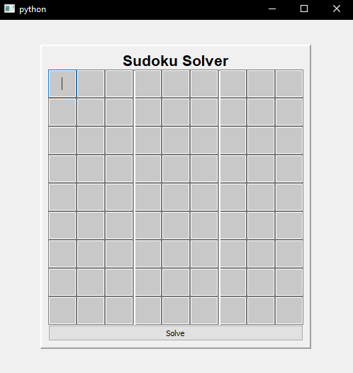
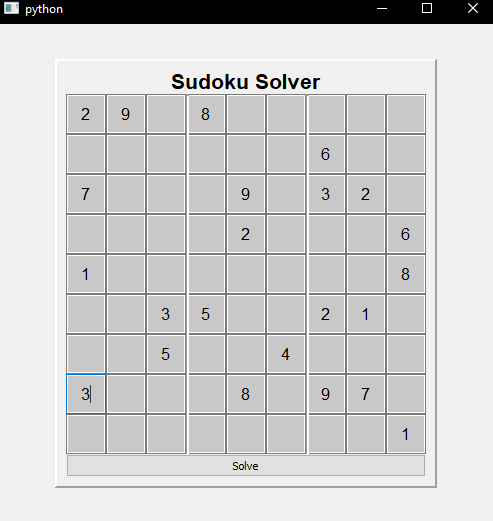
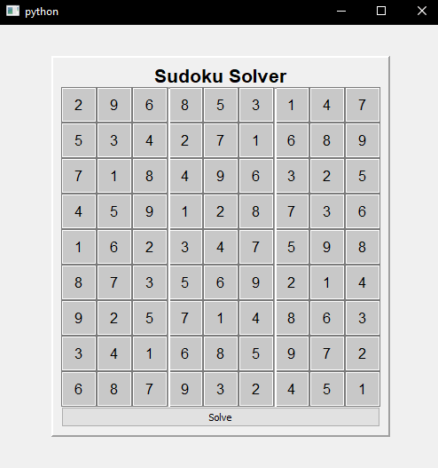

# Sudoku-Solver
This project is a python desktop app that finds the solution to any typical 9x9 possible Sudoku puzzle. The specific algorithm used is a brute force back-tracking method. 

# Demo
Live Demo Screenshots below

# Features
 - Solves any possible 9x9 Sudoku puzzle
 - GUI includes text input for numbers
 - Inputs can be edited 

# Technologies Used
 - Back-tracking Algorithm
 - PyQT5 for the interactive GUI

# Contact 
If you have any questions, suggestions, or feedback, feel free to reach out to the project maintainer:

    Gieonne Sabijon
Thank you for your interest in this project!